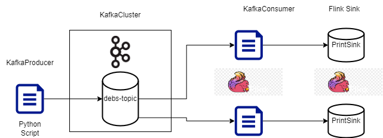

# Debs Grand Challenge 2024
## Introduction
This repository contains the code for [Kafka](https://kafka.apache.org/) Producer written in [Python](https://www.python.org/) and 
[Kafka](https://kafka.apache.org/) Consumer written in Java. We use [Kafka](https://kafka.apache.org/) and [Flink](https://flink.apache.org/) to process the streaming
data. The data that we are processing is from the [Debs Grand Challenge 2024](https://2024.debs.org/).

## Architecture
The architecture of the system is shown in the following figure:

First we have a [Kafka](https://kafka.apache.org/) producer that reads the data from csv file and sends it to the [Kafka](https://kafka.apache.org/) broker. Then we have a [Kafka](https://kafka.apache.org/) consumer that reads the data from the [Kafka](https://kafka.apache.org/) broker and processes it. The processed data is then sent to another [Kafka](https://kafka.apache.org/) topic. Finally, we have a [Flink](https://flink.apache.org/) job that reads the data from the [Kafka](https://kafka.apache.org/) topic.
Then, the Java application will process the streaming data using [Flink](https://flink.apache.org/) and send the result to the [Flink](https://flink.apache.org/) sink.

## Instructions
First you need to follow the instruction in the [kafka_producer](https://github.com/5IF-Cloud/kafka-streaming/blob/main/README.md)
repository to start the [Kafka](https://kafka.apache.org/) producer. Then you follow the instructions in the 
[streaming_consumer](https://github.com/5IF-Cloud/debs-2024/blob/main/README.md).

## Contact
If you have any questions, feel free to contact us:
- [Ngoc Minh NGO](mailto:ngoc-minh.ngo@insa-lyon.fr)
- [Danh Lan NGUYEN](mailto:danh.nguyen1@insa-lyon.fr)
- [Minh Duc PHUNG](mailto:minh.phung@insa-lyon.fr)
- [Quoc Viet PHAM](mailto:quoc.pham@insa-lyon.fr)